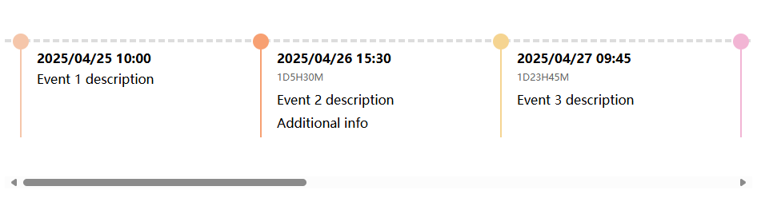

# Better-Horizontal-Timeline / 更好的横向时间轴组件

A simple and customizable horizontal timeline component written in vanilla JavaScript.  
一个用原生 JavaScript 编写的简单可定制横向时间轴组件。

---

## Features / 特性

- 📅 Display events on a horizontal timeline  
  将事件横向排列展示  
- 🎨 Auto-assign different colors to timeline points  
  时间点自动分配不同颜色  
- ⏳ Optionally display the time difference between events  
  可选地显示事件之间的时间差  
- 📏 Dynamically adjusts timeline length based on content  
  根据内容动态调整时间轴长度  
- ⚡ No external libraries required  
  无需外部依赖，纯 JavaScript 实现  

---

## Installation / 安装

Simply copy Timeline.js into your project:    
只需将 Timeline.js 文件复制到你的项目中：

```html
<script src="path/to/Timeline.js"></script>
<link rel="stylesheet" href="timeline.css">
```
---

## Usage / 使用方法
### 1. HTML
Prepare a container:  
准备一个容器：

```html
<div id="timelineContainer"></div>
```

### 2. JavaScript
Initialize the timeline:  
初始化时间轴：

```html
const timelineData = [
  {
    time: '2025-04-25 10:00',
    contents: ['Event 1 description']
  },
  {
    time: '2025-04-26 15:30',
    contents: ['Event 2 description', 'Additional info']
  },
  {
    time: '2025-04-27 09:45',
    contents: ['Event 3 description']
  }
];

const timeline = new Timeline('timelineContainer', timelineData, true);
```
---
## Timeline Data Format / 时间轴数据格式
Each event object should follow this structure:  
每个事件对象应遵循以下结构：
```html
{
  time: 'YYYY-MM-DD HH:mm',      // event time / 事件时间
  contents: [                    // array of HTML strings / HTML 内容数组
    'Content line 1',
    'Content line 2',
    // ...
  ]
}
```


---
## License / 许可证
This project is licensed under the MIT License.  
本项目采用 MIT 许可证开源。

---
## Author / 作者
Developed by DayeImba.  
由 DayeImba 开发。
